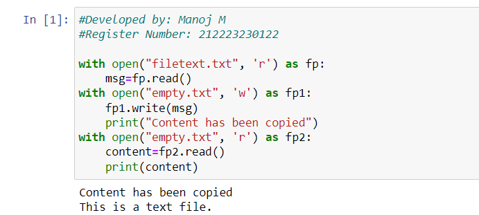

# Copy-File
## AIM:
To write a python program for copying the contents from one file to another file.
## EQUIPEMENT'S REQUIRED: 
PC
Anaconda - Python 3.7
## ALGORITHM: 
### Step 1:
Create a text file with some content in it.

### Step 2: 
Open the created text file.
 
### Step 3: 
Create another empty text file.

### Step 4:  
Copy the content of text file to empty file using write function.


## PROGRAM:
```
#Developed by: Manoj M
#Register Number: 212223230122

with open("filetext.txt", 'r') as fp:
    msg=fp.read()
with open("empty.txt", 'w') as fp1:
    fp1.write(msg)
    print("Content has been copied")
with open("empty.txt", 'r') as fp2:
    content=fp2.read()
    print(content)
```

### OUTPUT:


## RESULT:
Thus the program is written to copy the contents from one file to another file.
